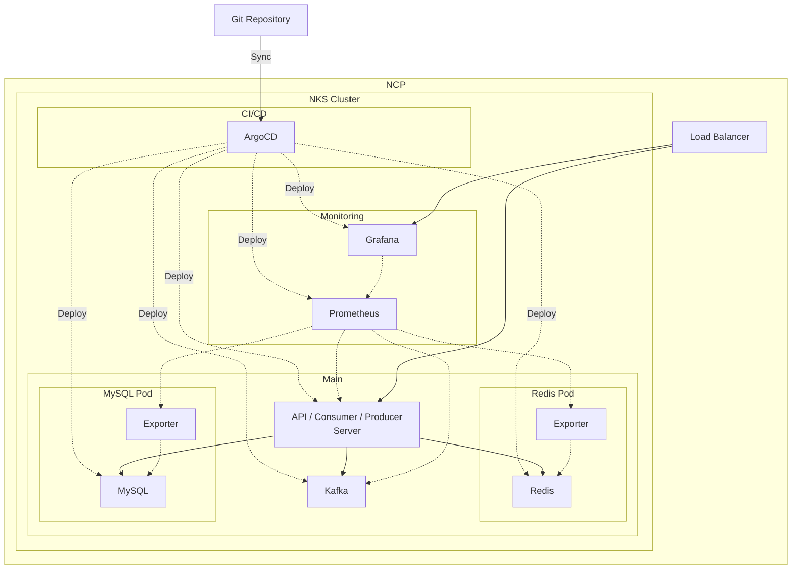

# News Feed Service

k8s 위에서 돌아가는 실시간 뉴스 피드 서비스

## 🏗 아키텍처

### 아키텍처 설명

본 프로젝트는 **이벤트 드리븐 아키텍처**를 채택하여 확장 가능하고 실시간 응답이 가능한 뉴스 피드 시스템을 구현합니다.

- **ArgoCD**: GitOps 기반 지속적 배포(CD)를 통해 Kubernetes 리소스 자동 관리 및 동기화
- **Golang Server**: REST API, Kafka Producer, Kafka Consumer를 단일 서버에서 통합 운영
- **Kafka**: 새 게시물 생성 시 팔로워들에게 비동기적으로 피드 전달
- **Redis**: 사용자별 피드를 캐싱하여 빠른 조회 성능 제공
- **MySQL**: 사용자, 게시물, 팔로우 관계의 영속적 데이터 저장
- **Prometheus & Grafana**: 시스템 모니터링 및 메트릭 시각화

### 데이터 플로우

1. 사용자가 게시물을 작성하면 MySQL에 아래와 같은 구조로 저장됩니다.
   - posts 테이블: { id, user_id, content, created_at }
2. 서버는 MySQL에서 해당 사용자의 팔로워 목록을 조회합니다.
   - follows 테이블: { follower_id, followee_id }
3. 각 팔로워에 대해 Kafka에 메시지를 발행합니다.
   - Kafka 메시지 예시: { post_id, author_id, follower_id, content, created_at }
4. Kafka Consumer가 메시지를 받아 각 팔로워의 Redis 피드에 게시물 ID(post_id)를 추가합니다.
   - Redis 구조 예시: key = feed:{follower_id}, value = 리스트 [post_id]
5. 사용자가 자신의 피드를 조회하면, Redis에서 해당 사용자의 post_id 리스트를 받아 각 post_id에 대해 MySQL에서 상세 정보를 조회하여 반환합니다.
   - Redis에서 post_id 리스트를 읽고, MySQL에서 게시물 상세 정보 조회 후 최신 게시물 순으로 반환

#### 전체 데이터 이동 예시

- 사용자가 게시물 작성 → MySQL 저장
- 팔로워 목록 조회 → Kafka 메시지 발행 (팔로워별)
- Kafka Consumer → Redis에 post_id 추가 (팔로워별)
- 사용자가 피드 조회 → Redis에서 post_id 리스트 조회 → MySQL에서 상세 정보 조회 후 반환

## ✨ 주요 기능

- ✅ **게시물 작성**: 텍스트 기반 게시물 생성
- ✅ **팔로우 시스템**: 다른 사용자 팔로우
- ✅ **실시간 피드**: 팔로우한 사용자의 게시물을 실시간으로 피드에 반영
- ✅ **이벤트 드리븐 처리**: Kafka를 통한 비동기 피드 업데이트
- ✅ **캐시 기반 조회**: Redis를 활용한 빠른 피드 조회