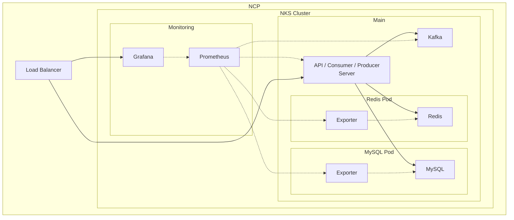

# News Feed Service

실시간 뉴스 피드 서비스 - Kafka 기반 이벤트 드리븐 아키텍처를 활용한 확장 가능한 소셜 미디어 피드 시스템

## 📋 목차

- [아키텍처](#-아키텍처)
- [주요 기능](#-주요-기능)
- [기술 스택](#-기술-스택)
- [프로젝트 구조](#-프로젝트-구조)
- [시작하기](#-시작하기)
- [API 명세](#-api-명세)
- [데이터베이스 스키마](#-데이터베이스-스키마)
- [배포](#-배포)

## 🏗 아키텍처



### 아키텍처 설명

본 프로젝트는 **이벤트 드리븐 아키텍처**를 채택하여 확장 가능하고 실시간 응답이 가능한 뉴스 피드 시스템을 구현합니다.

- **Unified Server**: REST API, Kafka Producer, Kafka Consumer를 단일 서버에서 통합 운영
- **Kafka**: 새 게시물 생성 시 팔로워들에게 비동기적으로 피드 전달
- **Redis**: 사용자별 피드를 Sorted Set으로 캐싱하여 빠른 조회 성능 제공
- **MySQL**: 사용자, 게시물, 팔로우 관계의 영속적 데이터 저장
- **Prometheus & Grafana**: 시스템 모니터링 및 메트릭 시각화 (계획)

### 데이터 플로우

1. 사용자가 게시물을 작성하면 MySQL에 저장
2. 해당 사용자의 팔로워 목록을 조회
3. 각 팔로워에 대해 Kafka 메시지 발행 (비동기)
4. Kafka Consumer가 메시지를 소비하여 각 팔로워의 Redis 피드에 추가
5. 사용자가 피드를 조회하면 Redis에서 빠르게 반환

## ✨ 주요 기능

- ✅ **게시물 작성**: 텍스트 기반 게시물 생성
- ✅ **팔로우 시스템**: 다른 사용자 팔로우
- ✅ **실시간 피드**: 팔로우한 사용자의 게시물을 실시간으로 피드에 반영
- ✅ **이벤트 드리븐 처리**: Kafka를 통한 비동기 피드 업데이트
- ✅ **캐시 기반 조회**: Redis를 활용한 빠른 피드 조회

## 🛠 기술 스택

### Backend
- **언어**: Go 1.24.4
- **웹 프레임워크**: Gin
- **메시지 브로커**: Apache Kafka (franz-go 클라이언트)
- **데이터베이스**: MySQL 8.0
- **캐시**: Redis 7.2
- **쿼리 빌더**: Squirrel

### Infrastructure
- **컨테이너**: Docker & Docker Compose
- **오케스트레이션**: Kubernetes (Helm Chart)
- **클라우드**: Naver Cloud Platform (NCP)
- **모니터링**: Prometheus, Grafana (계획)

## 📂 프로젝트 구조

```
news-feed/
├── bin/
│   └── main.go                 # 애플리케이션 진입점
├── config/
│   └── config.go               # 설정 로더
├── accessor/                   # 데이터 액세스 레이어
│   ├── kafka_accessor.go       # Kafka 프로듀서/컨슈머
│   ├── mysql_accessor.go       # MySQL CRUD 작업
│   └── redis_accessor.go       # Redis 캐시 작업
├── listener/
│   └── rest_listener.go        # REST API 엔드포인트
├── manager/
│   └── kafka_manager.go        # Kafka 메시지 처리 로직
├── dto/                        # Data Transfer Objects
│   ├── kafka_message.go
│   └── post.go
├── db_schema/                  # 데이터베이스 스키마
│   ├── user.sql
│   ├── post.sql
│   └── follow.sql
├── helm_chart/                 # Kubernetes 배포 설정
│   ├── Chart.yaml
│   ├── values.yaml
│   └── templates/
│       ├── kafka-deployment.yaml
│       ├── mysql-deployment.yaml
│       ├── redis-deployment.yaml
│       └── newsfeed-deployment.yaml
├── docker-compose.yml          # 로컬 개발 환경
├── Dockerfile                  # 애플리케이션 컨테이너 이미지
├── config.json                 # 애플리케이션 설정
├── go.mod                      # Go 모듈 의존성
└── README.md
```

## 📡 API 명세

### Health Check

```http
GET /ping
```

**응답 예시:**
```json
{
  "message": "pong"
}
```

### 회원가입

```http
POST /signup
Content-Type: application/json

{
  "username": "user123",
  "password": "securepassword"
}
```

**응답 예시:**
```json
{
  "user_id": 1
}
```

### 로그인

```http
POST /login
Content-Type: application/json

{
  "username": "user123",
  "password": "securepassword"
}
```

**응답 예시:**
```json
{
  "user_id": 1
}
```

### 게시물 작성

```http
POST /posts
Content-Type: application/json

{
  "user_id": 1,
  "content": "Hello, World!"
}
```

**응답 예시:**
```json
{
  "post_id": 42
}
```

**동작:**
- 게시물이 MySQL에 저장
- 작성자의 팔로워들에게 Kafka 메시지 발행
- Kafka Consumer가 각 팔로워의 Redis 피드에 게시물 추가

### 팔로우

```http
POST /follow
Content-Type: application/json

{
  "follower_id": 1,
  "followee_id": 2
}
```

**응답 예시:**
```json
{
  "follow_id": 10
}
```

### 피드 조회

```http
GET /posts?user_id=1
```

**응답 예시:**
```json
{
  "posts": [
    {
      "id": 42,
      "content": "Hello, World!",
      "user_id": 2,
      "created_at": "2025-10-12T10:30:00Z"
    },
    {
      "id": 41,
      "content": "Another post",
      "user_id": 3,
      "created_at": "2025-10-12T09:15:00Z"
    }
  ]
}
```

**동작:**
- Redis Sorted Set에서 사용자의 피드 조회 (최대 100개)
- 게시물 ID 목록으로 MySQL에서 상세 정보 조회
- 시간 역순 정렬 (최신순)

## 🗄 데이터베이스 스키마

### User 테이블

```sql
CREATE TABLE user (
    id BIGINT UNSIGNED NOT NULL AUTO_INCREMENT PRIMARY KEY,
    username VARCHAR(64) NOT NULL UNIQUE,
    password VARCHAR(255) NOT NULL
);
```

### Post 테이블

```sql
CREATE TABLE post (
    id BIGINT UNSIGNED NOT NULL AUTO_INCREMENT PRIMARY KEY,
    content TEXT NOT NULL,
    user_id BIGINT UNSIGNED NOT NULL,
    created_at DATETIME NOT NULL DEFAULT CURRENT_TIMESTAMP,
    FOREIGN KEY (user_id) REFERENCES user(id)
);
```

### Follow 테이블

```sql
CREATE TABLE follow (
    id BIGINT UNSIGNED NOT NULL AUTO_INCREMENT PRIMARY KEY,
    follower_id BIGINT UNSIGNED NOT NULL,
    followee_id BIGINT UNSIGNED NOT NULL,
    FOREIGN KEY (follower_id) REFERENCES user(id),
    FOREIGN KEY (followee_id) REFERENCES user(id),
    UNIQUE KEY uniq_follow (follower_id, followee_id)
);
```

## 🐳 배포

#### 배포되는 리소스

- **Zookeeper**: Kafka 조정 서비스
- **Kafka**: 메시지 브로커
- **Redis**: 캐시 레이어
- **MySQL**: 영속 데이터 스토어
- **News Feed Server**: 메인 애플리케이션 (API + Producer + Consumer)

## 📊 모니터링 (계획)

프로덕션 환경에서는 다음 메트릭을 모니터링할 예정입니다:

- **애플리케이션 메트릭**: API 응답 시간, 요청 수, 에러율
- **Kafka 메트릭**: 메시지 처리량, 컨슈머 렉, 파티션 상태
- **Redis 메트릭**: 캐시 히트율, 메모리 사용량, 연결 수
- **MySQL 메트릭**: 쿼리 성능, 연결 풀, 슬로우 쿼리
